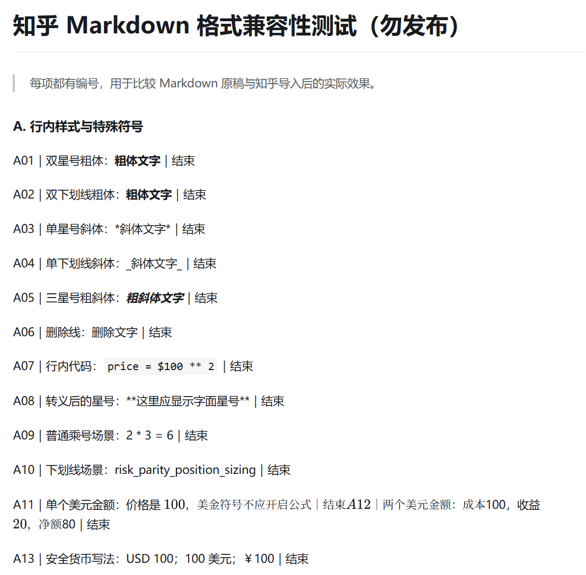
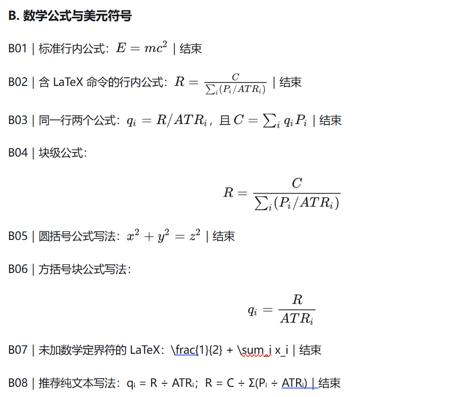
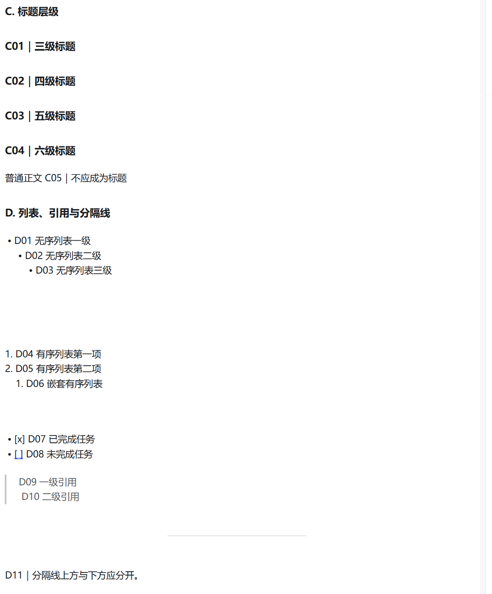
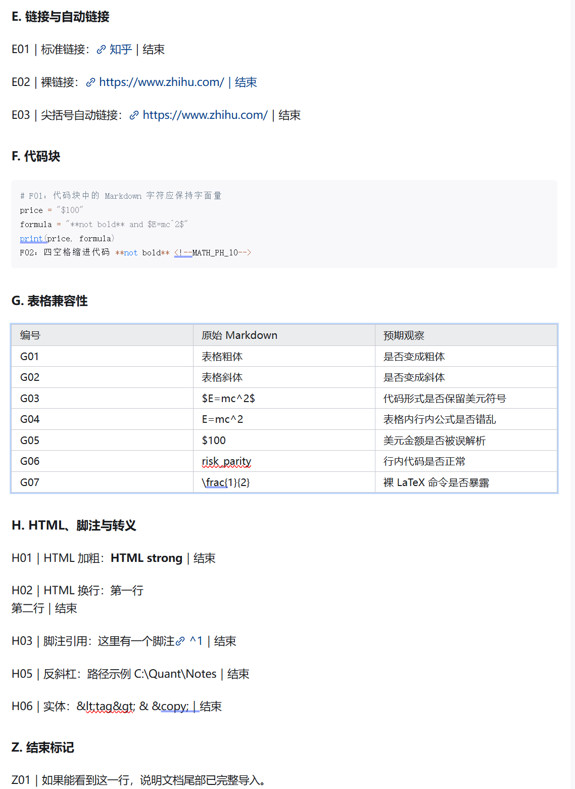

# 把本地 Markdown 稳妥导入知乎草稿：一个可复用的 Codex Skill

把一篇带图片、公式、表格和目录的 Markdown 文章搬进知乎，看起来只是“点一下导入”。真正麻烦的是导入之后：图片可能缺失，表格里的公式可能露出 LaTeX，美元金额可能被误判为公式，标题层级也可能和本地预览完全不同。

为了解决这些重复问题，我整理了一个开源 Codex Skill：**Zhihu Markdown Draft**。它负责生成知乎导入版、检查兼容性、导入草稿并验证保存结果。默认只保存草稿，不会发布文章。

截至 2026 年 8 月 28 日，Skill 已在 GitHub 正式开源：<https://github.com/wild-firefox/zhihu-markdown-draft>，仓库名为 `zhihu-markdown-draft`。仓库包含 Skill 本体、中文使用说明、预处理脚本、兼容性测试原稿和实测结论。

## 它能做什么

- 保留原始 Markdown，另外生成知乎专用导入稿。
- 自动识别文章标题，避免正文重复出现一级标题。
- 检查本地图片、公式分隔符、表格内数学内容和常见 Markdown 兼容问题。
- 必要时把本地图片上传到知乎，再使用知乎托管地址重建草稿。
- 插入知乎原生目录，并验证目录数量和条目。
- 导入后检查开头、结尾、图片、表格、公式和自动保存状态。
- 除非用户单独明确要求，否则绝不点击发布。

## 如何安装

最方便的方式是让 Codex 使用 Skill Installer：

```text
使用 $skill-installer 安装这个 Skill：
https://github.com/wild-firefox/zhihu-markdown-draft
```

也可以把仓库复制到个人 Skill 目录。Windows 通常是：

```text
%USERPROFILE%\.codex\skills\zhihu-markdown-draft
```

安装后重新打开 Codex 任务即可。

## 第一次使用：先完成知乎登录

第一次运行时，Codex 打开的浏览器可能还没有登录知乎。这时需要你自己在那个页面扫码，或者用知乎支持的其他方式完成登录，然后告诉 Codex“已经登录”。

Skill 只复用浏览器里已经存在的登录会话，不需要读取密码、Cookie、二维码内容或登录令牌。

## 一个典型用法

你可以直接这样描述任务：

```text
使用 $zhihu-markdown-draft，把 D:\文章\示例.md 写入一个新的知乎草稿。
添加知乎原生目录，只保存草稿，不发布。
```

Skill 会先生成导入副本和 JSON 检查报告。只有图片路径、危险公式和兼容性问题处理完成后，才会进入知乎编辑器。

如果目标草稿已经有正文，Skill 不会直接追加导入，因为知乎导入会把新内容接在旧内容后面。它会先说明需要清空并重新导入，在执行清空前单独确认。

## 实证：哪些 Markdown 在知乎会出问题

这套规则不是凭感觉写的。我创建了一篇独立测试草稿，把常见 Markdown 写法逐项导入，再检查知乎生成的实际编辑结构。

测试原稿已经放在仓库的 `assets/markdown-compatibility-test.md`，完整结论位于 `references/zhihu-markdown-compatibility.md`。任何人都可以复制测试原稿，在新的测试草稿中复现。

## 截至 2026-08-28 的知乎预览实测

下面四张图来自同一篇“知乎 Markdown 格式兼容性测试”草稿的预览页面。测试只用于观察导入效果，没有发布。结果反映的是 2026 年 8 月 28 日看到的知乎文章编辑器行为；知乎后续更新解析器后，结论可能变化。



行内样式方面，双星号和双下划线粗体都能正常渲染，三星号粗斜体与删除线也能工作。单星号、单下划线斜体的标记仍会露出，不适合作为稳定格式。行内代码可以安全保留美元符号和星号；普通乘号与变量名中的下划线也能按正文显示。

美元金额仍是最危险的情况。测试里的单个或多个裸美元金额没有按原文保留美元符号，A11 与 A12 还在预览中连成了同一段。这说明正文金额不要写成裸美元符号加数字，应改成 `USD 100`、`100 美元` 或 `￥100`。



成对的行内公式和块公式可以正确渲染，包括分式、求和与上下标。同一行放置多个完整公式也能工作。没有数学定界符的 LaTeX 命令会原样露出；如果不需要正式公式，使用 Unicode 或纯文本表达更稳妥。



Markdown 的 H3、H4、H5 和 H6 在知乎预览里呈现为同一种标题样式，层级差异基本消失。无序列表、有序列表和嵌套列表可以保留缩进；任务列表不会转换成复选框，而是直接显示 `[x]` 与 `[ ]`。引用块可以正常显示，分隔线也能形成明显的段落间隔。



标准 Markdown 链接和自动链接能够点击，围栏代码块也能保留代码中的 Markdown 字符。四空格缩进代码会进入代码块，并可能暴露数学转换占位符。表格本身可以生成，但单元格里的强调、行内代码、公式定界符和裸 LaTeX 都不可靠：有的格式会退化成纯文本，有的命令会直接露出。

有限的 HTML 在本次测试中有部分效果，例如 `<strong>` 和 `<br>`；但 Markdown 脚注会生成异常链接，命名实体也可能直接显示源字符，因此不应依赖它们完成关键排版。

综合预览结果，当前最稳妥的导入策略是：正文使用普通粗体、标准链接和围栏代码；完整数学表达式放在表格外；表格只放纯文本或 Unicode 数学；货币金额不用裸美元符号；任务列表和脚注在导入前改写成普通列表与“注：”段落。

实测中最值得注意的是以下几类问题。

1. 普通正文里的双星号粗体可以正常使用。例如 `**粗体文字**` 会变成粗体。截图里出现裸露双星号，并不代表知乎完全不支持粗体，更可能是转义、代码、表格或相邻错误公式破坏了解析。
2. 单星号和单下划线斜体不可靠。`*斜体*` 和 `_斜体_` 在测试中直接显示了标记。
3. 美元金额最危险。正文中的 `$100` 会开启一个公式范围；知乎可能一直找到后文的下一个美元符号，跨段吞掉普通文字并把它们渲染成一条巨大公式。
4. 真正的数学公式可以使用成对的美元定界符。行内公式和块公式都能正常渲染，但必须完整、成对，而且不能把美元符号当货币单位。
5. 表格中的 Markdown 格式会丢失。粗体、斜体和行内代码可能只剩普通文字；表格内公式可能丢掉定界符，却不会生成公式。
6. Markdown 的 H2 到 H6 在知乎里会被压成同一个可见标题层级。因此，只有需要进入知乎目录的内容才应该使用标题标记。
7. 任务列表会显示原始的方括号标记；Markdown 脚注会变成错误链接；四空格缩进代码中的数学内容还可能留下异常占位符。

针对美元金额，最稳妥的写法是 `USD 100`、`100 美元` 或 `￥100`。针对表格公式，优先使用 Unicode 和纯文本，例如 `qᵢ = R ÷ ATRᵢ`。

## 预处理脚本如何提前发现问题

仓库中的脚本可以单独运行：

```powershell
python scripts/prepare_zhihu_markdown.py SOURCE.md --output ARTICLE_知乎导入版.md --strip-first-h1
```

脚本会生成导入稿和检查报告。新版检查会标记：

- 类似 `$100` 的危险货币符号；
- 未配对的数学定界符；
- 没有包在公式里的 LaTeX 命令；
- 表格内公式和格式标记；
- 单星号、单下划线斜体；
- 任务列表、脚注、缩进代码；
- 会被知乎压平的深层标题；
- 后面紧跟中文字符的裸链接。

这些检查只负责发现问题，不会在没有依据时悄悄改变文章含义。

## 图片与长文章

知乎导入本地 Markdown 时，本地图片路径不能直接成为线上图片。Skill 会先记录图片位置，上传后取得知乎托管地址，再生成最终导入稿。

对于长文章，它不会依靠不稳定的鼠标坐标逐张插图，而是使用占位符和最终重导入流程。这样可以验证每张图片仍在正确段落附近。

## 为什么只保存草稿

导入成功和公开发布是两件不同的事。这个 Skill 把“导入”“写入”和“存入草稿”都解释为草稿操作。只有用户单独明确要求发布时，才会进入发布步骤。

这既避免误发布，也方便作者在知乎里继续检查封面、话题、声明和最终排版。

## 开源文件在哪里

仓库中的主要文件如下：

- `SKILL.md`：技能入口和工作流程。
- `scripts/prepare_zhihu_markdown.py`：确定性的预处理与检查脚本。
- `references/zhihu-editor-workflow.md`：知乎编辑器操作与验证细节。
- `references/zhihu-markdown-compatibility.md`：实测兼容性结论。
- `assets/markdown-compatibility-test.md`：可复现的测试原稿。
- `assets/zhihu-skill-open-source-guide.md`：也就是本文的 Markdown 原稿。

如果知乎编辑器以后改变了解析方式，可以重新导入测试原稿，更新兼容性结论和规则，而不需要从零猜测。

## 结语

Markdown 到知乎真正需要解决的，不是“能不能导入”，而是“导入后是否仍然是同一篇文章”。把兼容性检查、图片处理、目录和草稿验证整理成 Skill 后，这套流程就可以重复使用，也更容易开源协作。

本文结束标记：ZHIHU_SKILL_GUIDE_END。
